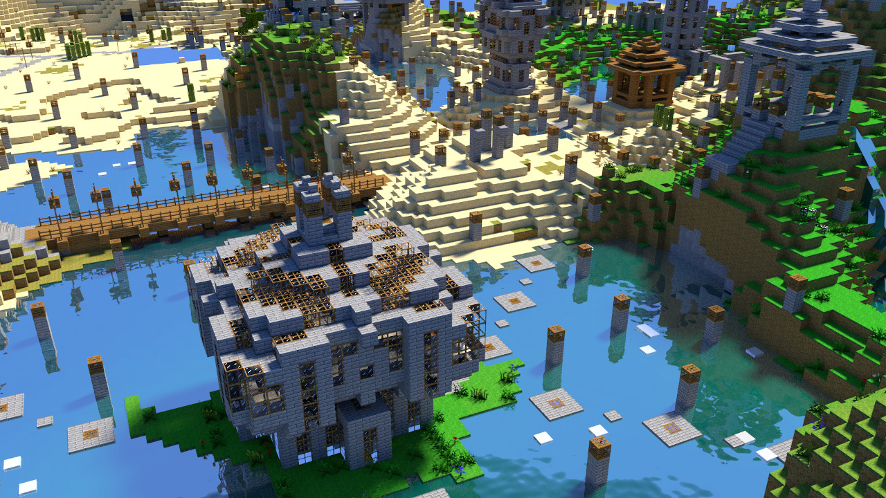

# SCWE - SurvivalCraft World Exporter
This program converts a Survivalcraft world file to ply models

## Motivation
Export your world into ply models, then render it with Blender or anything that supports ply models. 

As an example, you can get great images like this one. 



## Usage
For those who aren't familiar with CLI, double click `SCWE.Windows.exe`, and then follow the instruction provided.

This program is smart enough to detect the system language and default to English if no translation is provided in `languages.xml`

Or you can go with the programmer's way
```
SCWE.Windows.exe [-c chunkx,chunky] [-r radius] [-v vertex_threshhold] [-j thread_count] [-lang en|zh] an_example_world.scworld
```
Where an example usage could be
```
SCWE.Windows.exe -c 1,2 -r 60 -v 1000000 -j 1 example_world_name.scworld
```
In this case, the program generates all chunks within 60-chunk from the chunk (1,2), using 1 thread, and seperate the entire model into smaller models with no more than 1,000,000 vertices before writing them to disk. 

All the models will be written to a folder with the same name as the `.scworld` file, under the same directory as the `.scworld` file.
